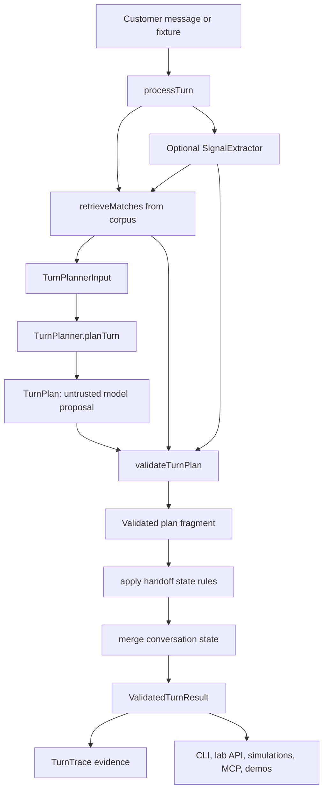
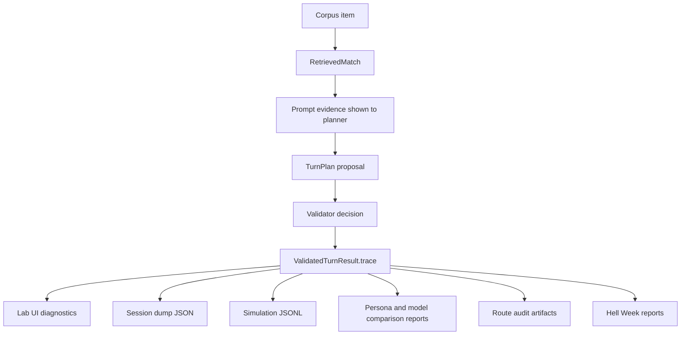

# Loanslam TurnPlanner Core

> **Status: Phase 0 engine proof with integrated POC migration queued.** This
> repo is proving the TurnPlanner engine before productising ticket webhooks or
> real PII intake. Existing widget-adapter demo surfaces remain deployable for
> demonstrations until the integrated POC becomes the new deployable surface.

> **Confidential and proprietary.** This is private client work. See
> [LICENSE](./LICENSE). Do not copy, repurpose, redistribute, or publish this
> repository or its materials without permission.

## Practical takeaway

The useful thing in this repo is not a finished chat product yet. It is the
model-backed decision engine and its evidence loop: customer message plus session
state goes through retrieval, an untrusted `TurnPlan`, deterministic validation,
and trace output that reviewers can inspect.

If you are trying to understand or change behaviour, start with
[`docs/llm-turn-planner-architecture.md`](./docs/llm-turn-planner-architecture.md)
and the `packages/core` workspace. If you are deciding product scope or safety
boundaries, start with [`docs/product-brief.md`](./docs/product-brief.md).

## Current architecture



The validator is the hard authority. The model may propose the next turn, but it
cannot decide policy, collect forbidden credentials, invent account facts, bypass
serving-mode rules, or send arbitrary UI instructions.

## Safety boundaries

- Do not answer personal account questions anonymously.
- Do not invent account values, loan outcomes, balances, dates, rates, or policy.
- Do not collect sort codes, account numbers, card details, CVV/CVC, or online banking credentials.
- Do not continue normal routing after vulnerability, hardship, complaint, legal, accessibility, or distress signals.
- Do not let the frontend make business or safety decisions.
- Do not treat static/unit evidence as enough for user-visible routing behaviour.
- Do treat live lab API sessions and trace artifacts as the strongest Phase 0 evidence.

## Fast start

Install dependencies:

```bash
npm install
```

List operator commands:

```bash
just --list
```

Probe one turn:

```bash
just core-turn -- --message "How do I apply?"
```

Drive the engine interactively:

```bash
just core-chat -- --trace
```

Start the local lab API and Vue inspector:

```bash
just lab
```

Model-backed commands require `OPENAI_API_KEY`. `OPENAI_MODEL` can override the
default planner model.

## Vercel + Neon demo deployment

The Vercel entrypoint is [`api/index.ts`](./api/index.ts). It serves the
demo-safe `/demo` API plus the built review host/widget assets, and it writes
owner-only interaction receipts through Prisma to Postgres.

Required Vercel/Neon environment:

- `DATABASE_URL`: pooled Neon Postgres URL used by runtime Prisma traffic.
- `DATABASE_URL_UNPOOLED` or `DATABASE_MIGRATE_URL`: direct URL used by Prisma migrations.
- `DEMO_STATE_TOKEN_SECRET`: stable secret for opaque continuation tokens.
- `OPENAI_API_KEY`: required for planner-backed demo turns.
- `DEMO_ACCESS_TOKEN`: optional bearer or `x-demo-access-token` gate for shared demos.

Useful commands:

```bash
just prisma-generate
just prisma-migrate-deploy
just vercel-build
```

`just prisma-migrate-deploy` and `just vercel-build` are database/deployment
commands, not routine local checks. `just vercel-build` runs `prisma migrate
deploy` against the configured migration database before building the deployed
review assets.

## Which surface should I use?

- `just core-turn` is for one message and one `ValidatedTurnResult`.
- `just core-chat -- --trace` is for manual turn-by-turn probing in a terminal.
- `just core-serve -- --port 8787` is the dev-only HTTP lab API over `processTurn`.
- `just lab` starts the lab API plus the Vue engineer console on `5173`.
- `just mcp-lab-api` exposes the lab API through local MCP tools for agent-driven sessions.
- `just core-simulate` runs the fixed journey suite and writes JSONL traces.
- `just core-persona-simulate` runs persona scenarios and writes transcript/report artifacts.
- `just core-stochastic` runs the StochasticTestSimulator evidence workflow.
- `just hell-week` runs the hostile scenario gauntlet and writes an HTML dashboard; pass `--store-db --db <url>` to persist the run to Postgres.
- `just hell-week-stability` classifies repeated Hell Week runs already persisted in Postgres.
- `just demo` starts the Loanslam customer-facing iframe demo around the Phase 0 engine; use `just demo-local` for a no-Postgres local UI check.
- `just review` starts the MAL review demo around the same engine; use `just review-local` for a no-Postgres local UI check.
- `just demo-log-summary` queries owner-only demo interaction receipts from Postgres.
- `just site-dev`, `just site-build`, and `just site-preview` operate the separate Astro site surface.

## Repository map

```text
docs/
  product-brief.md                  Product scope and safety contract
  llm-turn-planner-architecture.md  Canonical Phase 0 engine architecture
  stochastic-test-simulator-guide.md
  prds/                             Time-stamped product and implementation specs
packages/
  contracts/                        Shared Zod contracts and runtime types
  core/                             Engine, retrieval, validator, planner adapters, CLI, lab API, evidence harnesses
  lab-ui/                           Vue engineer console for traces, retrieval, overrides, and session export
  mcp-server/                       Local MCP wrapper around the lab API
  demo-widget/                      Loanslam-facing iframe widget demo
  demo-host/                        Host page for the demo widget
  review-widget/                    MAL review widget demo
  review-host/                      Host page for the review widget
prisma/
  schema.prisma                     Postgres schema for owner-only demo interaction receipts and Hell Week evidence
api/
  index.ts                          Vercel Function entrypoint for demo deployment
data/
  public-info/                      Synthetic Loanslam corpus treated as approved Phase 0 policy data
scripts/
  throwaway/                        Ad hoc probes, not the operator front door
artifacts/
  phase0/                           Generated local traces, reports, dashboards, and session dumps
```

## Package roles

- `packages/contracts` owns the shared Zod schemas for `CorpusItem`, `TurnPlan`, `TurnTrace`, `ValidatedTurnResult`, simulation reports, stochastic artifacts, and planner ports.
- `packages/core` owns `processTurn`, corpus loading, retrieval, OpenAI planner adapters, signal extraction, validation, local lab API, CLI commands, simulations, route audits, STS, and Hell Week.
- `packages/lab-ui` visualizes the lab API result with action, serving mode, retrieval, validator overrides, safety flags, requested fields, raw trace JSON, and session export.
- `packages/mcp-server` lets agents start, drive, dump, reset, and summarize lab API sessions without browser automation.
- `packages/demo-*` and `packages/review-*` are customer-facing demo shells over the current engine; `api/index.ts` mounts the review demo for Vercel.

## Knowledge base and policy data

`data/public-info/loanslam-synthetic-kb.json` is the Phase 0 corpus. Its
`serving_mode` field is live policy data:

- `answer` means the item can ground a customer-facing answer.
- `handoff_account_specific` means the subject needs human support with account context.
- `route_vulnerability` means the turn must route through the vulnerability/escalation path.
- `excluded` means the subject is recognized but must not be answered substantively.

Retrieval scores are evidence, not release gates. The hard rule is simpler: an
`answer` needs approved grounding, and non-answer serving modes must route, refuse,
or fall back safely.

## Evidence workflow

The central evidence object is `ValidatedTurnResult.trace`. It links the customer
message to retrieval matches, selected/effective serving mode, proposed action,
final action, validator overrides, safety flags, planner metadata, policy version,
and request/message IDs.

Use live lab sessions when judging user-visible routing behaviour. Static tests are
useful guardrails, but they are not enough to prove customer-visible flow.

Use Hell Week for broad model-backed safety and routing evidence:

```bash
just hell-week -- --profile smoke --store-db
just hell-week-judge -- <run-dir>
just hell-week -- --from <run-dir> --judge-verdicts <verdicts.json>
just hell-week-compare -- <baseline-run-dir> <candidate-run-dir>
just hell-week-stability -- --runs <run1,run2,run3> --set-id <iteration-id> --db "$DATABASE_URL"
```

Live Hell Week captures preflight `HELL_WEEK_DATABASE_URL`,
`DEMO_INTERACTION_DATABASE_URL`, or `DATABASE_URL` with a real Postgres query
before any model calls start.

Deterministic-only reports are capped at `needs_work`; `ship_ready` requires
merged judge verdicts and safety-floor coverage.

Postgres-backed Hell Week reports are the durable source for replayable evidence.
Single runs live in `hell_week_runs`, `hell_week_scenarios`,
`hell_week_turns`, and `hell_week_grades`. Repeated-run stability reports live in
`hell_week_run_sets`, `hell_week_run_set_members`,
`hell_week_run_set_scenarios`, and `hell_week_run_set_pairwise_comparisons`.
Use `core:hell-week -- --from-db <runId>` or
`core:hell-week-stability -- --from-db <setId>` to regenerate report artifacts
from Postgres.



## Development gates

These commands do not call a model. They check the local TypeScript workspace:

```bash
just test
just source-policy
just typecheck
just build
just verify
just format-check
```

Run them when you need verification. They are not automatically required for every
docs-only change.

`just source-policy` enforces the Phase 0 TypeScript source convention from the
decision log: project-local TypeScript imports stay extensionless, while
third-party package export paths remain allowed to use their published names.
`just build` includes the same guard before the workspace build; its stdout and
stderr are part of the verification evidence.

Do not use `just vercel-build` as a substitute for these local gates. It follows
the deployment build path and can apply committed Prisma migrations.

The Astro site lives in `site/` outside the root npm workspaces. For site changes,
run:

```bash
just site-build
```

## Source-of-truth docs

- [Product brief](./docs/product-brief.md)
- [LLM Turn Planner architecture](./docs/llm-turn-planner-architecture.md)
- [Integrated POC reference](./docs/prds/2026-06-30-integrated-poc-reference.md)
- [Integrated POC implementation agenda card](./docs/prds/2026-07-01-integrated-poc-implementation-agenda-card.md)
- [Stakeholder demo safe display boundary](./docs/prds/2026-06-16-stakeholder-demo-safe-display-boundary-prd.md)
- [Hell Week gauntlet](./docs/hell-week-gauntlet.md)
- [Hell Week agent loop playbook](./docs/hell-week-agent-loop-playbook.md)
- [StochasticTestSimulator guide](./docs/stochastic-test-simulator-guide.md)
- [Hell Week evidence index](./artifacts/evidence-index/hell-week-runs.md)

Documentation cleanup records live under
[`docs/non-operational/doc-cleanup/`](./docs/non-operational/doc-cleanup/). They
are not product or runtime authority unless an active agenda card points at them.

## Not built in Phase 0

- Production Express API
- Production Vue widget deployment
- AWS/OpenTofu deployment
- Durable production audit store
- SQL/CRM/customer-record integration
- Real ticket webhook side effects
- Real PII intake infrastructure
- Autonomous self-learning

These are deferred, not cancelled. Phase 0 earns them by producing credible engine
and evidence behaviour first.

## License

Proprietary and confidential. All rights reserved. See [LICENSE](./LICENSE). No
permission is granted to use, copy, modify, repurpose, or distribute this software
or its materials without prior written permission of the copyright holder.
