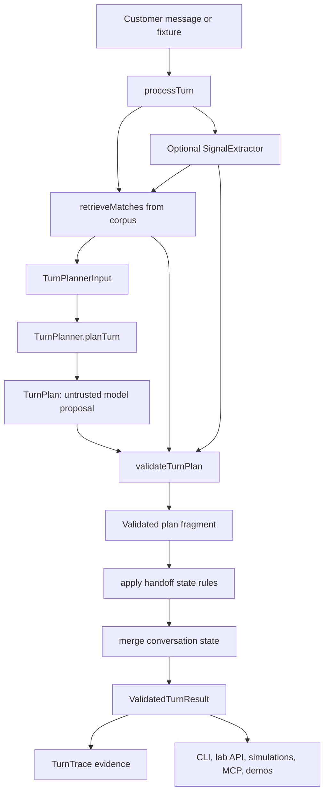

# Loanslam TurnPlanner Core

> **Status: Nuxt keeper site plus Phase 0 engine proof.** The current live
> keeper surface is `packages/site-nuxt` (`loanslam-site-nuxt` on Railway). The
> older Astro deployment path and standalone IPOC deployment path are historical;
> site-nuxt now owns the migrated site content, styles, and public assets.

> **Confidential and proprietary.** This is private client work. See
> [LICENSE](./LICENSE). Do not copy, repurpose, redistribute, or publish this
> repository or its materials without permission.

## Practical takeaway

The useful thing in this repo is not a finished account product yet. It is the
current Nuxt site surface plus a model-backed decision engine and evidence loop:
customer message plus session state goes through retrieval, an untrusted
`TurnPlan`, deterministic validation, and trace output that reviewers can
inspect.

If you are trying to understand or change behaviour, start with
[`docs/llm-turn-planner-architecture.md`](./docs/llm-turn-planner-architecture.md)
and the `packages/core` workspace. If you are deciding product scope or safety
boundaries, start with [`docs/product-brief.md`](./docs/product-brief.md).

## Current architecture



The validator is the hard authority. The model may propose the next turn, but it
cannot decide policy, collect forbidden credentials, invent account facts, bypass
serving-mode rules, or send arbitrary UI instructions.

## Safety boundaries

- Do not answer personal account questions anonymously.
- Do not invent account values, loan outcomes, balances, dates, rates, or policy.
- Do not collect sort codes, account numbers, card details, CVV/CVC, or online banking credentials.
- Do not continue normal routing after vulnerability, hardship, complaint, legal, accessibility, or distress signals.
- Do not let the frontend make business or safety decisions.
- Do not treat static/unit evidence as enough for user-visible routing behaviour.
- Do treat live lab API sessions and trace artifacts as the strongest Phase 0 evidence.

## Fast start

Install dependencies:

```bash
npm install
```

List operator commands:

```bash
just --list
```

Probe one turn:

```bash
just core-turn -- --message "How do I apply?"
```

Drive the engine interactively:

```bash
just core-chat -- --trace
```

Start the current Nuxt site locally:

```bash
just site-nuxt-build
just site-nuxt-dev
```

Start the local lab API and Vue inspector:

```bash
just lab
```

Model-backed commands require `OPENAI_API_KEY`. `OPENAI_MODEL` can override the
default planner model.

## Current Surface Map

| Surface | Status | Use it for |
| --- | --- | --- |
| `packages/site-nuxt` | current keeper site and concierge surface; live service is `loanslam-site-nuxt` | Site, concierge, current deployable proof, Railway read-back |
| `site/` | retained historical site docs only; not the live deploy path | Prior parity and application-flow evidence docs |
| `packages/integrated-poc` | source/shared modules consumed by Nuxt; standalone Railway deployment retired | IPOC server/session/admin code that Nuxt still imports |
| `packages/demo-*` | historical Loanslam iframe demo shell | Legacy local comparison only |
| `packages/review-*` | MAL review shell and public sanitized reports | Review/demo host checks and report publishing |
| `packages/core` | engine, CLI, Hell Week, STS, lab API | Runtime behavior and proof batteries |
| `packages/lab-ui` / `packages/mcp-server` | local engineering surfaces | Trace inspection and agent-driven lab sessions |

Do not treat `railway.json`, Astro `site/dist`, or the old standalone IPOC pack
as current deployment authority. The retained deployment target is the Nuxt
keeper service and its verified dependencies.

## Which surface should I use?

- `just core-turn` is for one message and one `ValidatedTurnResult`.
- `just core-chat -- --trace` is for manual turn-by-turn probing in a terminal.
- `just core-serve -- --port 8787` is the dev-only HTTP lab API over `processTurn`.
- `just lab` starts the lab API plus the Vue engineer console on `5173`.
- `just mcp-lab-api` exposes the lab API through local MCP tools for agent-driven sessions.
- `just core-simulate` runs the fixed journey suite and writes JSONL traces.
- `just core-persona-simulate` runs persona scenarios and writes transcript/report artifacts.
- `just core-stochastic` runs the StochasticTestSimulator evidence workflow.
- `just hell-week` runs the hostile scenario gauntlet and writes an HTML dashboard; pass `--store-db --db <url>` to persist the run to Postgres.
- `just hell-week-stability` classifies repeated Hell Week runs already persisted in Postgres.
- `just site-nuxt-dev` starts the current site surface.
- `just site-nuxt-build` builds the current site surface.
- `just demo` starts the historical Loanslam iframe demo around the Phase 0 engine; use `just demo-local` only for legacy local comparison.
- `just review` starts the MAL review demo around the same engine; use `just review-local` for review-host checks.
- `just demo-log-summary` queries owner-only demo interaction receipts from Postgres.
- `site/` is historical Astro material only, not a Nuxt input or live deploy surface.

## Repository map

```text
docs/
  product-brief.md                  Product scope and safety contract
  llm-turn-planner-architecture.md  Canonical Phase 0 engine architecture
  stochastic-test-simulator-guide.md
  prds/                             Time-stamped product and implementation specs
packages/
  contracts/                        Shared Zod contracts and runtime types
  core/                             Engine, retrieval, validator, planner adapters, CLI, lab API, evidence harnesses
  site-nuxt/                        Current keeper site and concierge surface
  integrated-poc/                   IPOC source/modules consumed by the current Nuxt surface
  lab-ui/                           Vue engineer console for traces, retrieval, overrides, and session export
  mcp-server/                       Local MCP wrapper around the lab API
  demo-widget/                      Frozen historical Loanslam-facing iframe widget demo
  demo-host/                        Host page for the demo widget
  review-widget/                    MAL review widget demo
  review-host/                      Host page for the review widget
prisma/
  schema.prisma                     Postgres schema for owner-only demo interaction receipts and Hell Week evidence
api/
  index.ts                          Legacy Vercel/review demo entrypoint
data/
  public-info/                      Non-deployable synthetic proof corpus for Phase 0 routing evidence
scripts/
  throwaway/                        Ad hoc probes, not the operator front door
artifacts/
  evidence-index/                   Committed evidence manifests, run indexes, and gate anchors
  phase0/                           Ignored local traces, reports, dashboards, and session dumps
```

## Package roles

- `packages/contracts` owns the shared Zod schemas for `CorpusItem`, `TurnPlan`, `TurnTrace`, `ValidatedTurnResult`, simulation reports, stochastic artifacts, and planner ports.
- `packages/core` owns `processTurn`, corpus loading, retrieval, OpenAI planner adapters, signal extraction, validation, local lab API, CLI commands, simulations, route audits, STS, and Hell Week.
- `packages/site-nuxt` owns the current keeper site, concierge API, and customer-facing Nuxt surface.
- `packages/integrated-poc` owns IPOC session/admin modules still consumed by the Nuxt surface; it is not a standalone live deployment target.
- `packages/lab-ui` visualizes the lab API result with action, serving mode, retrieval, validator overrides, safety flags, requested fields, raw trace JSON, and session export.
- `packages/mcp-server` lets agents start, drive, dump, reset, and summarize lab API sessions without browser automation.
- `packages/demo-widget` is frozen for sunset; keep behavior work out of it unless deleting or migrating the package. `packages/demo-host` and `packages/review-*` are legacy/review shells over the current engine; they are not the keeper site deployment.

## Knowledge base and policy data

`data/public-info/loanslam-synthetic-kb.json` is a synthetic Phase 0 proof
corpus. It is marked `deployment_status: "non_deployable_synthetic"` and
`deployable: false`; it is useful for routing, grounding, and Hell Week evidence,
but it is not approved public copy for regulated lending facts or contact
details. Customer-facing contact facts belong in
`packages/site-nuxt/data/site-copy/contact.json` until an approved runtime corpus
replaces the synthetic one.

Inside the proof corpus, `serving_mode` is policy data:

- `answer` means the item can ground a customer-facing answer.
- `handoff_account_specific` means the subject needs human support with account context.
- `route_vulnerability` means the turn must route through the vulnerability/escalation path.
- `excluded` means the subject is recognized but must not be answered substantively.

Retrieval scores are evidence, not release gates. The hard rule is simpler: an
`answer` needs approved grounding, and non-answer serving modes must route, refuse,
or fall back safely.

## Evidence workflow

The central evidence object is `ValidatedTurnResult.trace`. It links the customer
message to retrieval matches, selected/effective serving mode, proposed action,
final action, validator overrides, safety flags, planner metadata, policy version,
and request/message IDs.

Use live lab sessions when judging user-visible routing behaviour. Static tests are
useful guardrails, but they are not enough to prove customer-visible flow.

Use Hell Week for broad model-backed safety and routing evidence. The full
command surface, receipt semantics (floor-delta), the committed baseline
anchor, and the Postgres-backed durable reports are documented once in
[Proof and gates](./docs/loanslam-operator/05-proof-and-gates.md) and the
[Hell Week agent loop playbook](./docs/hell-week-agent-loop-playbook.md).

## Development gates

These commands do not call a model. They check the local TypeScript workspace
and generated report pages:

```bash
npm test
npm run source-policy:check
npm run typecheck
npm run build
npm run verify
npm run format:check
```

Run them when you need verification. They are not automatically required for every
docs-only change. Gate doctrine, `source-policy` semantics, and the pre-commit
enforcement layer are documented in
[Proof and gates](./docs/loanslam-operator/05-proof-and-gates.md).

Do not use `just vercel-build` as a substitute for these local gates. It follows
the deployment build path and can apply committed Prisma migrations.

The current site lives in `packages/site-nuxt`. For site changes, run:

```bash
just site-nuxt-build
```

The legacy `site/` tree is historical Astro material. Current site content,
styles, and public assets live under `packages/site-nuxt`.

## Source-of-truth docs

- [Product brief](./docs/product-brief.md)
- [LLM Turn Planner architecture](./docs/llm-turn-planner-architecture.md)
- [Campaign workflow protocol](./docs/campaign-workflow-protocol.md)
- [Active PRDs and campaign cards](./docs/prds/README.md)
- [Roadmaps](./docs/roadmaps/README.md)
- [Operator manual](./docs/loanslam-operator/README.md)
- [Hell Week gauntlet](./docs/hell-week-gauntlet.md)
- [Hell Week agent loop playbook](./docs/hell-week-agent-loop-playbook.md)
- [StochasticTestSimulator guide](./docs/stochastic-test-simulator-guide.md)
- [Hell Week evidence index](./artifacts/evidence-index/hell-week-runs.md)

Closed PRDs and agenda cards under [`docs/prds/closed/`](./docs/prds/closed/)
are provenance, not active start points.

Documentation cleanup records live under
[`docs/non-operational/doc-cleanup/`](./docs/non-operational/doc-cleanup/). They
are not product or runtime authority unless an active campaign card points at them.

## Not built in Phase 0

- Production Express API
- Production Vue widget deployment
- AWS/OpenTofu deployment
- Durable production audit store
- SQL/CRM/customer-record integration
- Real ticket webhook side effects
- Real PII intake infrastructure
- Autonomous self-learning

These are deferred, not cancelled. Phase 0 earns them by producing credible engine
and evidence behaviour first.

## License

Proprietary and confidential. All rights reserved. See [LICENSE](./LICENSE). No
permission is granted to use, copy, modify, repurpose, or distribute this software
or its materials without prior written permission of the copyright holder.
