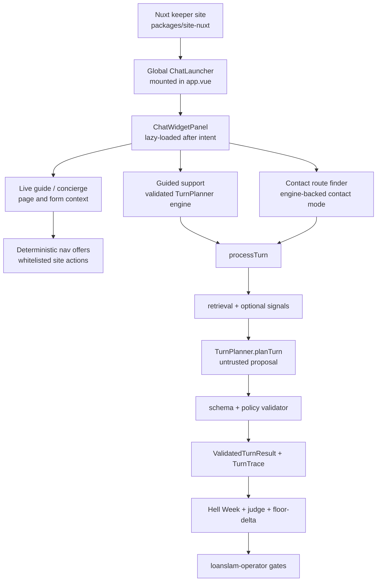

# LoanSlam Website, Assistant, And TurnPlanner Core

> **Status: rebuilt Nuxt website plus Phase 0 engine proof.** The current
> customer-facing keeper surface is `packages/site-nuxt`
> (`loanslam-site-nuxt` on Railway). The older Astro site, standalone IPOC
> deployment, and iframe demo shells are historical comparison surfaces unless a
> current campaign explicitly names them.

> **Confidential and proprietary.** This is private client work. See
> [LICENSE](./LICENSE). Do not copy, repurpose, redistribute, or publish this
> repository or its materials without permission.

## Practical Takeaway

LoanSlam is now best understood as one connected system:

- a rebuilt Nuxt website that owns the live pages, public assets, styles, and
  application journey;
- a site-wide MAL Loans assistant that can operate in multiple modes across
  those pages; and
- a maturing TurnPlanner core whose behaviour is protected by Hell Week
  calibration and the `loanslam-operator` proof workflow.

This is still a Phase 0 support-engine proof, not a finished account-servicing
product. The repo is valuable because it proves how website context, assistant
routing, deterministic validation, traces, and hostile evaluation fit together
before production CRM, real PII intake, durable audit storage, and account access
are added.

## Current System



The key rule: the model proposes, the system decides. Customer-visible behaviour
is only trustworthy when it survives the right integration evidence path.

## Website Rebuild

`packages/site-nuxt` is the current website front door. It contains the migrated
content, Nuxt routes, chrome, responsive styles, public assets, application flow,
and the embedded assistant surface.

Important site files:

- `packages/site-nuxt/app.vue` mounts `SiteHeader`, `NuxtPage`, `SiteFooter`, and
  one global `ChatLauncher`.
- `packages/site-nuxt/components/ChatLauncher.vue` owns the floating launcher,
  lazy-loads the panel, listens for route-finder events, and toggles
  `body.mal-open`.
- `packages/site-nuxt/components/ChatWidgetPanel.vue` owns the transcript,
  assistant mode badge, mode switches, handoff/intake UI, streaming replies,
  page-aware welcomes, and session persistence.
- `packages/site-nuxt/components/ApplicationJourney.vue` exposes synthetic
  application-state context for the apply journey.
- `packages/site-nuxt/lib/pageSnapshot.ts` and
  `packages/site-nuxt/lib/formSnapshot.ts` read the rendered page/form without
  mutating it.
- `packages/site-nuxt/lib/navOffer.ts` turns assistant copy into whitelisted,
  one-tap navigation chips instead of letting the model navigate directly.

Use these commands for the current site:

```bash
just site-nuxt-dev
just site-nuxt-build
just site-nuxt-start
```

The retained `site/` tree is historical Astro material. Do not treat it as the
live deploy authority.

## Assistant Modes Across Pages

The chat button is available across the Nuxt site, but the panel is not one
undifferentiated bot. It switches between modes based on route, feature gates,
and customer intent.

| Mode                     | Where it appears                                                                             | What it is for                                                                                                                  | Protection boundary                                                                                                          |
| ------------------------ | -------------------------------------------------------------------------------------------- | ------------------------------------------------------------------------------------------------------------------------------- | ---------------------------------------------------------------------------------------------------------------------------- |
| **Live guide**           | Most pages when concierge is enabled                                                         | Explaining the page the customer is on, using header nav, page links, page buttons, and synthetic apply-form state on `/apply/` | Segregated `/api/concierge` route, rate limits, `CONCIERGE_KILL_SWITCH`, prompt guardrails, deterministic nav-chip whitelist |
| **Guided support**       | Support/account/safety turns, forced support handoff, and routes where concierge is not used | Grounded support answers, safe fallback, handoff intake, ticket-shaped confirmation, and telemetry                              | `processTurn`, `TurnPlanner`, schema validation, serving-mode policy, deterministic state rules, traces                      |
| **Contact route finder** | `/contact/` and route-finder open events                                                     | Steering application, repayment, existing-loan, complaint, and contact-route questions to the right support path                | Engine-backed contact mode plus the same validated UI/action contract                                                        |
| **Seam handling**        | Whenever the active serving surface changes                                                  | Showing the customer that the assistant has moved between Live guide and Guided support                                         | Mode badge, transcript divider, and server-owned routing rules                                                               |

The Live guide is a demo concierge surface. It can see page context and, on the
apply journey, synthetic form state. It streams through OpenAI and can offer
deterministic navigation chips, but it is intentionally separate from the
validated support engine.

The Guided support path is the compliance proof surface. It sends turns through
the Phase 0 engine, gets a `ValidatedTurnResult`, emits content-free telemetry,
and renders only the UI primitives the backend selected.

## TurnPlanner Core

`packages/core` owns the engine. The canonical architecture is documented in
[`docs/llm-turn-planner-architecture.md`](./docs/llm-turn-planner-architecture.md).

The runtime shape is:

```text
conversation state + user message
  -> optional SignalExtractor
  -> retrieval matches
  -> TurnPlannerInput
  -> TurnPlanner.planTurn
  -> schema-valid TurnPlan
  -> validateTurnPlan
  -> deterministic handoff/state rules
  -> ValidatedTurnResult + TurnTrace
```

The TurnPlanner has matured from a simple answer generator into a bounded
planner inside a typed contract:

- it can use conversation history and retrieval to propose the next move;
- it can choose only allowed actions and UI primitives;
- it can cite grounding items and propose safety flags;
- it can recommend handoff fields and concise support copy;
- it cannot make policy, verify identity, mutate records, collect forbidden
  credentials, invent account facts, or reveal hidden instructions.

`serving_mode` is policy data:

- `answer` can ground a customer-facing answer.
- `handoff_account_specific` routes to human support with intake.
- `route_vulnerability` routes through the escalation path.
- `excluded` recognizes a subject that must not be answered substantively.

The validator is the hard authority. If the model proposes something unsafe,
ungrounded, malformed, or inconsistent with the allowed UI/action contract, the
engine routes to the safest valid action and records the override in the trace.

## Hell Week Calibration

Hell Week is the repo's hostile evaluation battery, encoded under
`packages/core/src/hellweek/` and documented in
[`docs/hell-week-gauntlet.md`](./docs/hell-week-gauntlet.md).

Run surfaces:

```bash
just hell-week -- --profile smoke
just hell-week -- --store-db
just hell-week-judge -- <run-dir>
just hell-week -- --from <run-dir> --judge-verdicts <run-dir>/judge-verdicts.json
just floor-delta -- <run-dir>
```

The full gauntlet currently covers 122 hostile scenarios. A run writes
`report.html`, `report.json`, `evidence.json`, and per-scenario judge packets
under `artifacts/phase0/hell-week-<profile>-<stamp>/`.

Grading deliberately has layers:

1. **Hard safety floor:** deterministic, non-negotiable demo-killer checks for
   credential leaks, invented account facts, directional approval estimates, and
   internal-data exposure.
2. **Advisory envelope:** deterministic action, serving-mode, and safety-flag
   signals that help triage but are not release proof by themselves.
3. **OpenAI judge:** independent review of transcript plus trace. A
   deterministic-only report can support local iteration, but `ship_ready`
   requires judge verdicts and safety-floor coverage.

The important maturation is cultural as much as technical: routing quality is
not proven by regex fixtures, unit tests, or a few happy paths. It is proven by
live model-backed evidence, judged customer-visible behaviour, and comparison
against the committed floor.

## loanslam-operator Quality Workflow

The `loanslam-operator` workflow is the quality-protection layer around this
repo. The human manual lives at
[`docs/loanslam-operator/README.md`](./docs/loanslam-operator/README.md); the
agent-facing dispatcher lives at
`.claude/skills/loanslam-operator/SKILL.md`.

Its core doctrine is simple: **verify before reporting**. Static checks prove
wiring. Behaviour claims require the integration surface that matches the
change.

For routine work:

```bash
just branch-risk -- --base dev
just self-gate
just gate-slice -- --staged
```

For website and assistant surface changes, add live read-back or the named proof
recipe:

```bash
just contact-assistant-proof -- <site-url-or-flags>
just seam-walk-proof -- <site-url-or-flags>
```

For TurnPlanner, validator, routing, signal, or Hell Week behaviour, the bar is
higher:

```bash
just hell-week -- --store-db
just hell-week-judge -- <run-dir>
just floor-delta -- <run-dir>
just gate-slice -- --staged
just checkpoint-packet -- <run-dir>
```

`artifacts/evidence-index/baseline.json` is the machine-readable floor anchor.
`floor-delta` compares candidate runs against that anchor and returns
`REPAIRED`, `HOLDING`, `REGRESSED`, or `INCONCLUSIVE`. `gate-slice` prevents
engine-touching commits from landing without a valid behaviour receipt and also
guards secrets and evidence paths.

This is how the repo avoids false confidence: the operator surface forces each
change through the proof bar that actually covers it.

## Fast Start

Install dependencies:

```bash
npm install
```

List the public operator commands:

```bash
just --list
```

Probe one planner-backed turn:

```bash
just core-turn -- --message "How do I apply?"
```

Drive the engine interactively:

```bash
just core-chat -- --trace
```

Start the local lab API and Vue diagnostics console:

```bash
just lab
```

Start the Nuxt site:

```bash
just site-nuxt-dev
```

Model-backed commands require `OPENAI_API_KEY`. This repo mandates OpenAI for
runtime inference, simulations, judges, evals, probes, and agentic test
workflows.

## Surface Map

| Surface                   | Current role                                     | Use it for                                                                        |
| ------------------------- | ------------------------------------------------ | --------------------------------------------------------------------------------- |
| `packages/site-nuxt`      | Current keeper website and assistant integration | Website rebuild, page-aware assistant, concierge API, live site proof             |
| `packages/core`           | TurnPlanner engine and evidence harnesses        | Routing, retrieval, validation, lab API, simulation, Hell Week                    |
| `packages/contracts`      | Shared Zod schemas and runtime contracts         | `TurnPlan`, `TurnTrace`, `ValidatedTurnResult`, corpus, report types              |
| `packages/integrated-poc` | Source modules still consumed by Nuxt            | IPOC session/admin code used by the current site; not standalone deploy authority |
| `packages/lab-ui`         | Engineer diagnostics console                     | Trace, retrieval, overrides, safety flags, session export                         |
| `packages/mcp-server`     | Agent-accessible lab API wrapper                 | Drive and dump local lab sessions without browser automation                      |
| `packages/review-*`       | Review shell and sanitized reports               | Review-host checks and report publishing                                          |
| `packages/demo-*`         | Frozen historical iframe demo                    | Legacy comparison only                                                            |
| `site/`                   | Historical Astro site                            | Prior parity records; not the current live surface                                |

## Repository Map

```text
docs/
  product-brief.md                  Product scope and safety boundary
  llm-turn-planner-architecture.md  Canonical Phase 0 engine architecture
  hell-week-gauntlet.md             Hostile scenario battery and grading layers
  hell-week-agent-loop-playbook.md  Bounded tuning loop
  loanslam-operator/                Human operator manual
packages/
  site-nuxt/                        Current Nuxt website and assistant surface
  core/                             Engine, planner adapters, validator, lab API, Hell Week
  contracts/                        Shared schemas and typed contracts
  integrated-poc/                   Modules consumed by the Nuxt surface
  lab-ui/                           Local diagnostics console
  mcp-server/                       MCP wrapper around lab API sessions
data/
  public-info/                      Non-deployable synthetic proof corpus
artifacts/
  evidence-index/                   Committed evidence anchors and run indexes
  phase0/                           Ignored local traces, dashboards, run folders
scripts/
  *.ts                              Gates, digest, branch-risk, report checks
```

## Development Gates

These checks do not by themselves prove customer-visible behaviour, but they are
the basic local wiring gate:

```bash
npm test
npm run source-policy:check
npm run typecheck
npm run build
npm run verify
npm run format:check
```

Use `just branch-risk -- --base <ref>` to learn the proof bar for a branch before
claiming it is safe. Do not use `just vercel-build` as a substitute for local
verification; it follows the deployment build path and can apply committed
Prisma migrations.

## Source-Of-Truth Docs

- [Product brief](./docs/product-brief.md)
- [LLM Turn Planner architecture](./docs/llm-turn-planner-architecture.md)
- [Operator manual](./docs/loanslam-operator/README.md)
- [Proof and gates](./docs/loanslam-operator/05-proof-and-gates.md)
- [Hell Week gauntlet](./docs/hell-week-gauntlet.md)
- [Hell Week agent loop playbook](./docs/hell-week-agent-loop-playbook.md)
- [Campaign workflow protocol](./docs/campaign-workflow-protocol.md)
- [Active PRDs and campaign cards](./docs/prds/README.md)
- [Roadmaps](./docs/roadmaps/README.md)
- [Hell Week evidence index](./artifacts/evidence-index/hell-week-runs.md)

Closed PRDs and agenda cards under `docs/prds/closed/` are provenance, not active
start points, unless an active campaign explicitly points at them.

## Not Built In Phase 0

- Production account access or customer-record mutation
- CRM / loan-database integration
- Durable production audit store
- Real PII intake infrastructure
- Real ticket webhook side effects
- Autonomous self-learning
- A production-grade account-servicing chatbot

These are deferred, not cancelled. Phase 0 earns them by making the site,
assistant, engine, and evidence loop credible first.

## License

Proprietary and confidential. All rights reserved. See [LICENSE](./LICENSE). No
permission is granted to use, copy, modify, repurpose, or distribute this
software or its materials without prior written permission of the copyright
holder.
