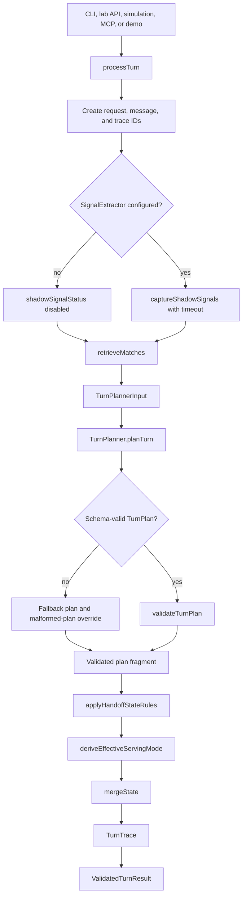
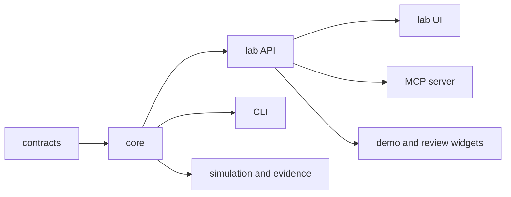
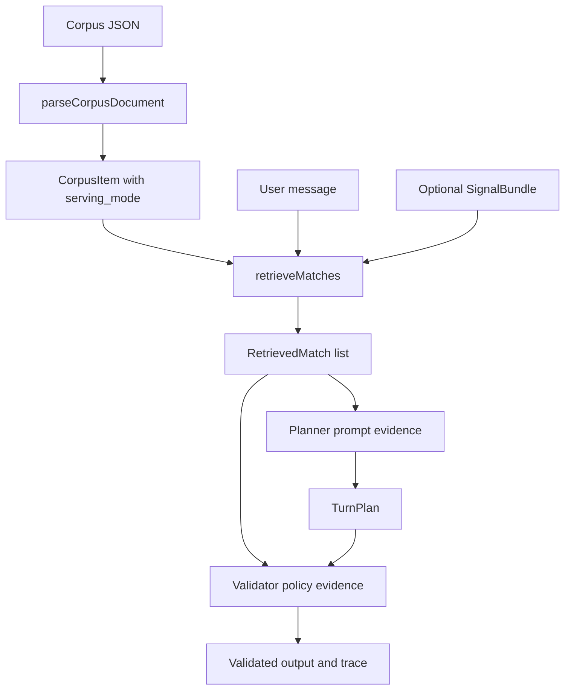

# Architecture & Technical Decisions

## Practical takeaway

The live architecture is Phase 0 engine proof, not the finished support product.
Current code proves `processTurn`, retrieval, model-backed planning, deterministic
validation, local traces, lab sessions, and simulation evidence. Product API,
widget deployment, durable persistence, ticketing, and real PII handling come
after the engine has earned productisation.

## Source-of-truth split

- `docs/product-brief.md` owns product scope, release rules, and safety boundaries.
- `docs/llm-turn-planner-architecture.md` owns the Phase 0 engine contract and flow.
- This document owns the repo-level architecture boundary between current engine proof and later productisation.
- `README.md` is the operator map for commands, packages, and evidence surfaces.

## Current Phase 0 runtime

`TurnPlan` is untrusted. `validateTurnPlan` and deterministic handoff state rules
are the policy boundary. Optional signal extraction can shape retrieval and trace
comparison, but it is not final authority.

## Current workspaces

- `packages/contracts` defines shared Zod contracts, planner ports, trace shapes, simulation reports, and stochastic artifacts.
- `packages/core` implements the engine, corpus parser, lexical retriever, OpenAI planner, optional signal extractor, validator, CLI, local lab API, simulations, route audit, STS, and Hell Week.
- `packages/lab-ui` is the local Vue engineer console over the lab API.
- `packages/mcp-server` wraps the lab API for local agent-driven sessions and evidence dumps.
- `packages/demo-widget` and `packages/demo-host` provide the Loanslam iframe demo over the Phase 0 engine.
- `packages/review-widget` and `packages/review-host` provide the MAL review demo over the same engine.

## Core engine boundary

The engine entrypoint is `processTurn` in `packages/core/src/engine.ts`.

Inputs:

- `ConversationState`
- user message text
- `TurnPlanner`
- optional `SignalExtractor`
- corpus items
- optional journey/turn metadata for traces

Outputs:

- updated conversation state
- original `TurnPlan`
- final enforced action and UI plan
- customer-facing message
- validator overrides
- `TurnTrace`

The important dependency direction is simple:

## Policy data and retrieval

The synthetic corpus in `data/public-info/loanslam-synthetic-kb.json` is treated
as approved Phase 0 policy data. Its `serving_mode` field governs whether a
matched item can be answered, routed, escalated, or refused.

Current retrieval is weighted lexical matching over corpus questions, variants,
tags, route reasons, and answer text. Optional signal bundles can add retrieval
queries, route hints, recommended serving mode, and safety signals. This is useful
for recall and evidence, but final action remains validator-owned.

## Validator authority

The validator is a hard-rule policy/schema backstop. It must override or reject
model output when the model proposes unsafe behaviour.

Hard boundaries include:

- answering without approved `serving_mode: answer` grounding
- citing a non-answer corpus item for an answer
- collecting forbidden payment or bank credentials
- promising account values, loan changes, dates, balances, rates, eligibility, or outcomes
- treating identity collection as verification
- continuing normal flow after vulnerability, hardship, complaint, legal, accessibility, or distress signals
- using a UI primitive that does not match the final action
- sharing internal traces, hidden prompts, or customer data

Conversation warmth, brevity, and clarification quality belong in journey reports
and model comparison. They should not become validator override rules unless they
cross a safety boundary.

## Evidence surfaces

`ValidatedTurnResult.trace` is the central evidence record. It is not the
production audit store, but it is the shape that teaches the product what should
be audited later.

Evidence is consumed by:

- CLI `core-turn` and `core-chat -- --trace`
- lab API session state
- lab UI diagnostics and export
- MCP session dumps and summaries
- fixed journey traces
- persona transcripts and reports
- model comparison reports
- stochastic run artifacts
- route audits and Hell Week dashboards

Live lab API simulations are the strongest Phase 0 evidence for user-visible
routing behaviour. Static tests are supporting guardrails.

## Hell Week evidence persistence

Hell Week evidence is persisted as test-run provenance, not product audit data.

Single-run reports are stored in Postgres across:

- `hell_week_runs`
- `hell_week_scenarios`
- `hell_week_turns`
- `hell_week_grades`

Repeated-run stability reports sit above those raw runs:

- `hell_week_run_sets`
- `hell_week_run_set_members`
- `hell_week_run_set_scenarios`
- `hell_week_run_set_pairwise_comparisons`

The run-set layer is for questions like "which dents are stable, recurring, or
one-off across three runs of the same iteration?" It links existing
`hell_week_runs`; it must not duplicate raw turn evidence. Use
`core:hell-week -- --store-db` to persist single runs,
`core:hell-week -- --from-db <runId>` to replay one run from Postgres, and
`core:hell-week-stability -- --runs <run1,run2,run3>` to store a repeated-run
stability report. Use `core:hell-week-stability -- --from-db <setId>` to replay
that derived report.

## Eventual productisation target

After the Phase 0 exit gate, the product can wrap the proven engine with the
production stack:

- Node 24 TypeScript API with route-local Zod contracts and safe middleware
- thin Vue iframe widget that renders backend-decided UI primitives
- durable transcript, audit, and evidence persistence behind explicit ports
- handoff intake and ticket webhook side effects
- iframe/session/cookie hardening
- AWS deployment and observability
- retention, access-control, and evidence-review processes

Do not let the eventual stack leak backward into Phase 0. The current engine should
stay portable and inspectable. Persistence and ticketing should be represented as
actions and traces until productisation begins.

## Session and widget decision

The eventual customer widget remains an iframe to avoid WordPress CSS and hosting
coupling. The production session strategy should keep the session identifier out of
browser JavaScript and keep business decisions on the backend.

The likely path is:

- CHIPS-compatible partitioned cookies during embedded development.
- A same-site delegated chat subdomain closer to production deployment.
- CSRF protection using a custom header and non-secret token strategy.
- Frontend rendering only; no business routing in the widget.

## Handoff intake alignment gap

Product-level wording names standard handoff intake as `fullName`, `dateOfBirth`,
`address`, `phone`, `email`, and `situationSummary`. The current Phase 0 contracts
use `fullName`, `dateOfBirth`, `postcode`, `email`, and `phone`.

Treat this as an explicit alignment item before productisation. Either update the
contracts to match the product wording, or record the narrower Phase 0 field set as
a deliberate engine-only slice. Do not silently build production PII infrastructure
around an accidental mismatch.

## Non-goals in the current architecture

- No production audit/customer database yet; current Postgres persistence is demo receipts and Phase 0 evidence provenance.
- No real customer-account reads or writes.
- No production ticket webhook side effects.
- No autonomous self-learning.
- No separate model-backed vulnerability detector unless trace evidence proves the single-planner path misses risk.
- No fixed retrieval score gates unless observed runs justify them.
