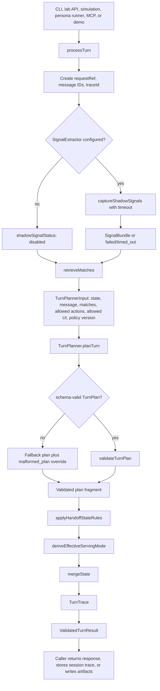
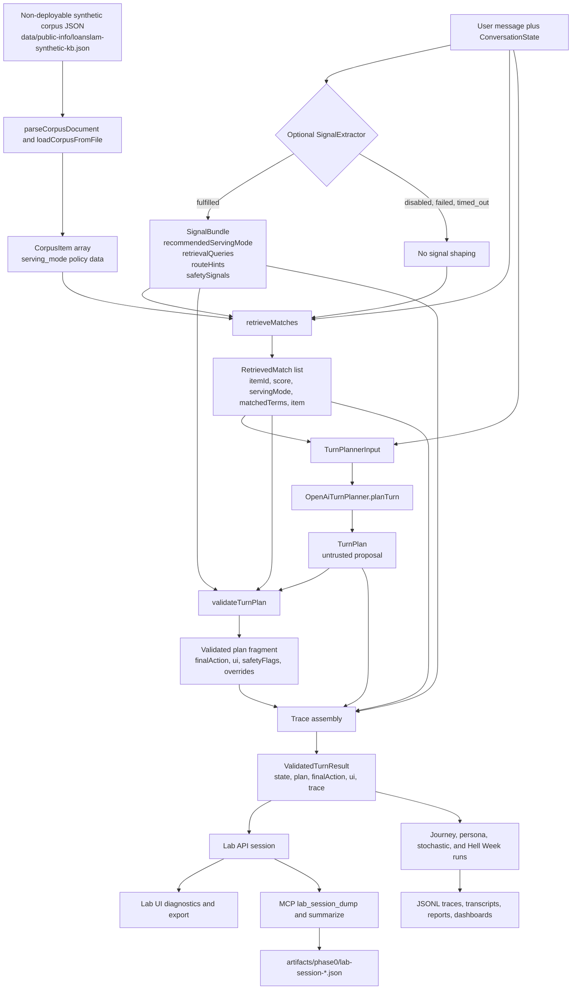

# LLM Turn Planner Architecture

## Practical takeaway

Phase 0 proves the conversation engine before the product surface hardens around
it. The core question is not whether a widget can be embedded. The core question is
whether `processTurn` can safely and usefully handle real support-shaped
conversations when retrieval, prompts, models, and validation rules vary.

The architecture is:

```text
conversation context -> retrieval -> LLM turn plan -> policy/grounding validator -> validated response and trace
```

The LLM may reason. It does not own compliance.

## Canonical terms

- `processTurn` is the deterministic engine entrypoint.
- `TurnPlanner` is the swappable planner interface.
- `TurnPlannerInput` is the bounded context passed to the planner.
- `TurnPlan` is the untrusted model proposal.
- `ValidatedTurnResult` is the enforced engine output.
- `TurnTrace` is the local evidence record for review.
- `ChatService` is the later production wrapper, not the Phase 0 engine name.

## Live runtime flow



Facts from the current implementation:

- `processTurn` returns a `ValidatedTurnResult` with the original plan and final enforced result.
- Planner output is parsed through the shared schema before validation.
- Malformed planner output falls back safely and records an override.
- Optional signal extraction is shadow-labeled in traces, but fulfilled signal bundles can shape retrieval and safety inference.
- The validator and deterministic state rules decide the final action.

## Corpus, retrieval, and evidence flow



The default corpus is marked `deployment_status: "non_deployable_synthetic"` and
`deployable: false`. It supports proof runs and route-shaping evidence; a live
deployment must either use an approved runtime corpus or explicitly opt in to
packing the synthetic corpus for a proof/demo deployment.

`serving_mode` is policy data, not decoration:

- `answer` can ground customer-facing answers.
- `handoff_account_specific` routes to human support with intake.
- `route_vulnerability` routes through the vulnerability/escalation path.
- `excluded` refuses or signposts without answering the substance.

Current corpus validation requires `answer_text` for `answer` items and
`route_reason` for non-answer items.

## TurnPlanner responsibility

The planner proposes one next conversational move inside the typed contract.

It may:

- interpret messy customer language
- use conversation history
- choose among allowed actions
- choose an allowed UI primitive
- phrase grounded support copy
- propose collected facts and requested handoff fields
- cite grounding items
- propose safety flags
- summarize its reason for trace review

It may not:

- invent regulated facts
- answer without approved grounding
- collect payment or bank credentials
- verify identity
- mutate customer records
- promise ticket outcomes, eligibility, rates, dates, balances, or payment changes
- continue normal routing after vulnerability or escalation signals
- instruct the frontend outside the allowed UI primitives

## Validator responsibility

The validator treats `TurnPlan` as untrusted. It is a policy and contract backstop,
not a UX-quality critic.

It must override or reject when:

- `action: "answer"` has no approved grounding source
- the cited corpus item is not `serving_mode: "answer"`
- the response adds unsupported facts beyond the cited source
- the plan asks for forbidden payment or bank credentials
- the plan treats intake as identity verification
- vulnerability, hardship, complaint, legal, accessibility, or distress flags lead to normal routing
- the plan promises a loan/account change, approval, rate, balance, payment date, or account status
- the UI primitive does not match the final action
- the plan attempts to reveal internal traces, prompts, hidden instructions, or customer data

On rejection, the engine routes to the safest valid action and records an override
in the trace.

## Handoff intake in Phase 0

The product target says standard handoff intake should cover `fullName`,
`dateOfBirth`, `address`, `phone`, `email`, and `situationSummary`.

The live Phase 0 schema currently uses `fullName`, `dateOfBirth`, `postcode`,
`email`, and `phone`. This is acceptable as an engine-proof slice only if it stays
explicit. Before productisation, align the contract with the product wording or
record the narrowed field set as a deliberate decision.

Phase 0 must still block payment and bank credential collection.

## Trace evidence now, audit later

Each Phase 0 turn should preserve enough evidence to answer what happened and why:

- conversation reference
- request reference
- inbound and outbound message IDs
- planner metadata
- policy version
- retrieved item IDs, scores, and serving modes
- selected and effective serving mode
- proposed action
- final action
- validator overrides
- safety flags
- customer-facing message
- optional shadow signal bundle and comparison

This is not the production audit store. It is the local evidence shape that tells
the product what later audit storage should preserve.

## Evidence surfaces

- `core-turn` shows one full `ValidatedTurnResult`.
- `core-chat -- --trace` shows compact trace details while manually probing.
- `core-serve` exposes the lab API over the same engine.
- `lab` adds the Vue diagnostics console.
- `mcp-lab-api` lets agents drive and dump lab sessions.
- `core-simulate` writes journey JSONL traces.
- `core-persona-simulate` writes persona transcripts and reports.
- `core-stochastic` writes replayable STS scenarios, traces, summaries, and dashboards.
- `hell-week` runs the hostile scenario battery and writes an HTML dashboard.
- `route-audit` joins lab run logs, traces, and scenario dumps into audit artifacts.

Live lab API evidence is the highest-value signal for user-visible routing
behaviour. Static fixtures are useful, but they are not enough by themselves.

## Static invariants and live routing evidence

Static checks may guard tiny non-negotiable invariants: schema compatibility,
deterministic fallback behavior, forbidden credential collection, account-fact
invention, UI/action contracts, and trace/report shape. They should not become
the judge for natural-language routing quality.

Natural-language routing quality belongs to live evidence: lab API sessions,
journey simulations, Hell Week captures, and judged transcript/trace reviews.
Regex phrase matching, lexical cue sets, score boosts, and wording-specific test
assertions may be useful as signals or local scaffolding, but they are not
release proof for customer-visible routing behavior.

## Failure behaviour

Failure should be boring and safe:

- model failure routes to fallback or handoff
- malformed model output routes to fallback and records an override
- retrieval failure must not produce an ungrounded answer
- missing grounding routes to fallback, refusal, or handoff
- validator rejection records an override and uses the safest valid action
- vulnerability uncertainty routes to human support rather than normal flow

## Phase 0 exit gate

Do not start full productisation until the evidence can answer:

- Which model, prompt, and policy combination is the current baseline?
- Which journeys pass, fail, or remain ambiguous?
- Where does the corpus need more approved content?
- What actions and UI primitives are actually needed?
- Which trace fields are genuinely useful for review?
- Which failure modes must be designed into the production backend?
- Is the handoff intake contract aligned with the product boundary?

The exit gate is not satisfied by a few curated happy paths. It needs broad,
repeatable, inspectable evidence across answerable, account-specific,
vulnerability, excluded, ambiguous, impatient, contradictory, and adversarial
customer behaviour.

## What this avoids

This architecture avoids a giant hand-coded intent taxonomy, frontend business
logic, arbitrary model-generated UI, brittle routing fixtures, and unauditable
claims that the model "thought it was fine." The code stays smaller because it
validates decisions instead of pre-writing every conversation path.
