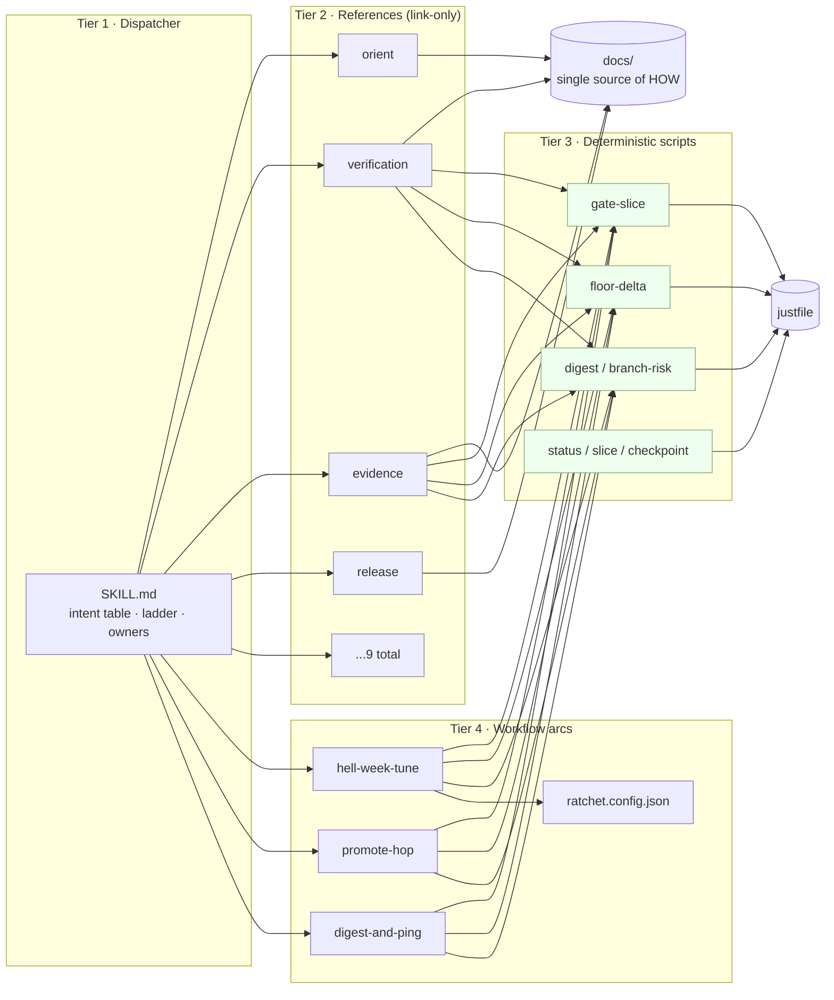

# 2. Architecture

[← Overview](01-overview.md) · Next: [Getting started →](03-getting-started.md)

The system is four tiers. Each tier has a strict rule about what may live there.
The point of the separation is **describe-once**: one operation has exactly one
canonical description, and human, agent, and controller all read it.



## Tier 1 — Dispatcher (`SKILL.md`)

Always loaded; thin and high-signal. Holds only the intent-routing table, the
OpenAI escalate-only ladder, the failure-owner table, quick ops, and the typed
workflow chains. It **routes and cites**; it never restates doctrine the agent
already loads and never wraps a `just` recipe. If content can live in a reference
or a doc, it does not belong here.

## Tier 2 — References (`references/*.md`)

Thin routers. Each names its canonical `docs/` source, the exact `just` targets,
and the disjoint write-scope. **A reference links to `docs/`; it does not copy
it.** Only [`write-scope-guardrails.md`](../../.claude/skills/loanslam-operator/references/write-scope-guardrails.md)
carries real prose, because those guardrails have no other home.

## Tier 3 — Deterministic scripts (`scripts/*`, repo root)

Lives at the repo root so it survives every worktree. Every load-bearing
guarantee is here **as code with a non-zero exit**, never as prose the model is
trusted to obey. Content-aware (parses verdicts and numbers), never
presence-only. Zero context cost: executed, returns exit codes / typed JSON.

## Tier 4 — Workflow arcs (`workflows/*.md` + `ratchet.config.json`)

Each arc is the sole narration of its multi-step sequence; the operator reference
and the controller read the same file. Ceilings in `ratchet.config.json` are
enforced fields the controller aborts on, not advisory prose.

## Why borrow Railway — and where it diverges

The Railway CLI skill is the template: dispatcher → reference playbooks →
deterministic scripts, with progressive disclosure and "read-only report first."
What transfers: the layering, the intent table, the deterministic tier.

What does **not** transfer:

- Railway is idempotent CRUD with terminal SUCCESS/FAILED. LoanSlam is stochastic
  behaviour tuning — a single read-back is not "done"; receipts need variance
  handling (`hell-week-stability`).
- No raw-API escape hatch (Railway's `railway-api.sh`). The deterministic tier
  here is **gates, not a bypass**.
- No per-scenario-category sub-references — that would recreate the brittle
  static-routing-restraint smell. Playbooks are per failure-**owner** instead.
- The full read-only proof costs live model calls, so the cheap self-gate runs
  first and the full battery is reserved for slice receipts.

## File map

```
.claude/skills/loanslam-operator/
  SKILL.md                      # Tier 1
  references/*.md               # Tier 2 (9 files)
  workflows/*.md                # Tier 4 arcs
  workflows/ratchet.config.json # Tier 4 config
.agents/skills/loanslam-operator -> .claude/skills/loanslam-operator
scripts/                        # Tier 3 (repo root)
  gate-slice.ts  floor-delta.ts  digest.ts  branch-risk.ts
  status-snapshot.sh  slice-worktree.sh  checkpoint-packet.sh
  hooks/pre-commit
  check-typescript-source-policy.ts   # extended for the OpenAI-only mandate
artifacts/evidence-index/baseline.json   # committed anchor
docs/loanslam-operator/         # this manual
```
