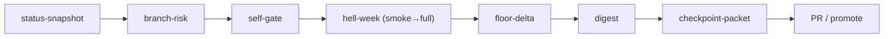

# 4. Operations catalog

[← Getting started](03-getting-started.md) · Next: [Proof and gates →](05-proof-and-gates.md)

Every operator action is a `just` target. This is the catalog; for flags and
exit codes see [Reference](09-reference.md).

## Orientation (read-only)

| Target | Does | Mutates? |
| --- | --- | --- |
| `just status-snapshot` | Branch, upstream, dirty state, worktrees, hook state | no |
| `just branch-risk -- --base dev` | Changed files → required proof bar | no |
| `just checkpoint-packet -- <run-dir>` | Orient + proof bar + evidence digest, one packet | no |

```sh
$ just status-snapshot
## status snapshot
- branch:   chore/core-maintainability-refactor
- upstream: (none) (n/a)
- working tree: 0 changed path(s)
- pre-commit gate: active (scripts/hooks)
- worktrees:
  - dev -> /Users/.../site-contact-widget-style
  - staging -> /Users/.../site-application-flow-style
  ...
```

## Gates (deterministic, no model)

| Target | Does | Exit |
| --- | --- | --- |
| `just self-gate` | `verify` (test+typecheck+build+reports+source-policy) + best-effort fallow audit | non-zero on failure |
| `just gate-slice` | Staged-diff keep-commit gate | non-zero on violation |
| `just floor-delta -- <run-dir>` | Score a run vs the committed anchor | non-zero on REGRESSED/INCONCLUSIVE |

```sh
$ just floor-delta -- artifacts/phase0/.../hell-week-full-...
floor-delta: HOLDING
  anchor hell-week-full-...(41/50) vs candidate hell-week-full-...(41/50)
  - no floor dimension regressed; floor still breached
  receipt: artifacts/evidence-index/floor-delta-latest.json
```

## Evidence (behaviour proof; live model + Postgres)

| Target | Does |
| --- | --- |
| `just hell-week -- --profile smoke` | 10-scenario fast tripwire |
| `just hell-week` | Full 122-scenario battery + HTML dashboard |
| `just hell-week-review -- <flags>` | Full battery → ladder judge → regrade |
| `just hell-week-judge -- <run-dir>` | Independent OpenAI judge → judge-verdicts.json |
| `just hell-week-stability -- --runs <r1,r2,r3>` | Classify stable / recurring / one-off |
| `just digest -- <run-dir>` | Typed-numbers digest (never reads transcripts) |

## Current site

| Target | Does |
| --- | --- |
| `just site-nuxt-dev` | Start the current Nuxt keeper site |
| `just site-nuxt-build` | Build the current Nuxt keeper site |
| `just contact-assistant-proof -- <url>` | Browser proof for assistant-first contact route finder |
| `just seam-walk-proof -- <url>` | Browser proof for concierge/engine seam UI |

## Worktrees and slices

| Target | Does |
| --- | --- |
| `just slice-new -- <owner>` | Create an isolated slice worktree for one disjoint owner |
| `just slice-new -- <owner> --dry-run` | Preview the plan, create nothing |

## Secrets (deterministic, no model)

| Target | Does |
| --- | --- |
| `just secrets-status` | Encrypted secret status, never prints values |
| `just secrets-render <env>` | Render to the ignored `.env.local` cache |
| `just secrets-run <env> -- <cmd>` | Run a command with decrypted secrets, no file |

## Setup

| Target | Does |
| --- | --- |
| `just hooks-install` | Activate the pre-commit gate (shared `core.hooksPath`) |

## How the pieces compose



Read-only orientation and the cheap self-gate come first; the cost-bearing Hell
Week run is reserved for producing a slice receipt.
