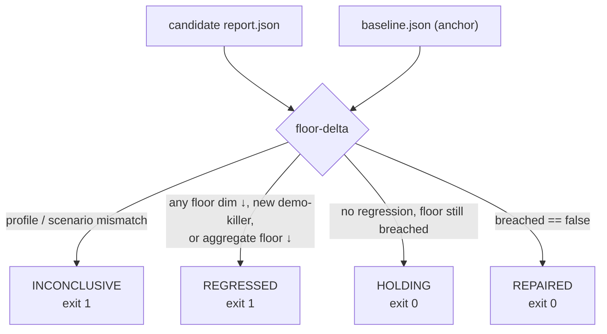
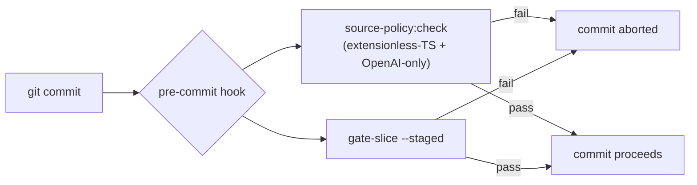

# 5. Proof and gates

[← Operations](04-operations.md) · Next: [Workflows →](06-workflows.md)

This is the heart of the system: what counts as proof, and the gates that make it
mechanical.

## The proof doctrine

> Integration evidence is the only proof of behaviour. A green `just verify` (or
> a passing smoke run) proves wiring/types/build — the live-model tests
> self-skip without `OPENAI_API_KEY`. Route/planner/validator/demo/Hell Week
> behaviour is proven only by a full Hell Week run scored against the committed
> baseline.

`just branch-risk` turns this into a per-change requirement:

| Tier | Triggered by | Required proof bar |
| --- | --- | --- |
| ENGINE | `packages/core/src/**` | Full Hell Week + judge + floor-delta receipt |
| SECRET | `secrets/`, `.env*`, `.sops` | Secret discipline; never commit decrypted |
| DEPLOY | `prisma/` | Migration review (vercel-build applies it) |
| BEHAVIOR_ADJACENT | `packages/core/`, `api/`, `mcp-server` | Lab-API/integration check + verify |
| UI | widgets/hosts/site | verify + live read-back |
| TOOLING / DOCS / BASELINE | scripts, configs, docs | verify |

## The committed anchor

`artifacts/evidence-index/baseline.json` pins one specific Hell Week run as the
breached starting point (currently 41/50: `human_support` 9/11, `prompt_injection`
6/9, `regulatory_boundary` 5/9). A candidate run is always measured against this
file's numbers — not a human markdown table, and not a freshly re-frozen live
run. The raw baseline report is not checked in; use the DB replay command in the
anchor when you need to regenerate a local report. Re-pin only by deliberate
human decision, to a run you inspected.

## floor-delta — the content-aware receipt

- **Keep a slice commit** on REPAIRED or HOLDING.
- **Promote** only on REPAIRED — "holding at breached" is not a ship signal,
  because the anchor itself is breached.
- It parses per-dimension numbers, so a stale or regressing receipt cannot pass a
  gate just by existing.

## gate-slice — the keep-commit gate

Runs over the **staged diff** and blocks the commit on:

1. Forbidden staged paths — `.env*` caches, `evidence.json` transcripts.
   (`*.env.sops` and `.env.example` are allowed.)
2. Forbidden staged content — API-key-shaped lines, private-key blocks.
3. Engine-touch without a behaviour receipt — a change under
   `packages/core/src/**` (non-test) requires a floor-delta receipt parsing
   REPAIRED or HOLDING.
4. demo↔review widget cross-pollination — an import across the boundary.

It does **not** regex-detect static routing restraints — a fuzzy lexical detector
would be exactly the brittle pattern the guardrails forbid. That stays a
human-review item.

## The enforcement layer

With no `.github/workflows` and no husky, this hook is the closest thing to CI.
Activate it with `just hooks-install`. See [Getting started](03-getting-started.md).

## Why the OpenAI-only mandate is mechanical

`scripts/check-typescript-source-policy.ts` flags Anthropic SDK **imports**
(`anthropic`, `@anthropic-ai/*`) via the AST — not a text grep, so it never
false-matches the word in comments, model ids, or docs. It runs inside
`test`, `typecheck`, `build`, and the pre-commit hook, so the mandate is checked
on every quality command.
