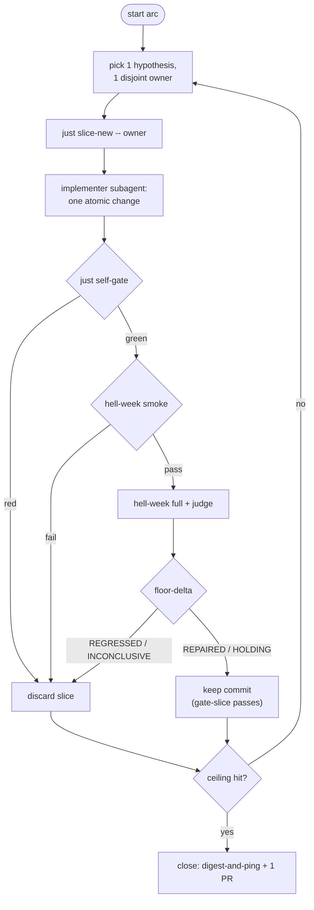
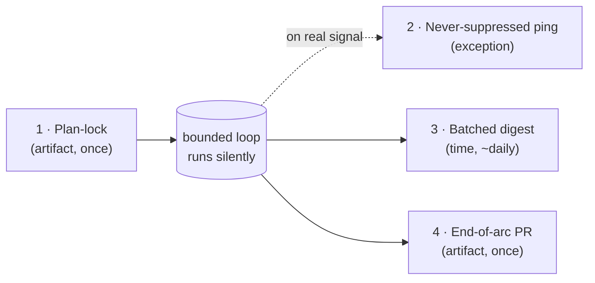

# 6. Workflows

[← Proof and gates](05-proof-and-gates.md) · Next: [Worktrees and promotion →](07-worktrees-and-promotion.md)

The dispatcher routes substantial work into named arcs. Each arc is narrated once
in [`workflows/`](../../.claude/skills/loanslam-operator/workflows/) and read by
both operator and controller.

## The typed chains

```mermaid
flowchart TD
    subgraph Refactor branch
      a1[orient] --> a2[verification] --> a3[verifier] --> a4{merge / fix / split}
    end
    subgraph Behaviour tuning
      b1[orient] --> b2[evidence] --> b3[implementer] --> b4[full integration proof] --> b5[floor-delta] --> b6{checkpoint}
    end
    subgraph Hell Week / judge
      c1[orient] --> c2[hell-week] --> c3[evidence] --> c4[judge] --> c5[stability / calibration] --> c6{checkpoint}
    end
    subgraph Deploy / demo polish
      d1[secrets] --> d2[verification] --> d3[release] --> d4[live read-back] --> d5{checkpoint}
    end
```

## The bounded tuning loop (`hell-week-tune`)

This is the autonomous arc. Its ceilings live in
[`ratchet.config.json`](../../.claude/skills/loanslam-operator/workflows/ratchet.config.json)
and the controller aborts when one is hit.

Stop conditions hand control back to a human: a per-dimension safety-floor
regression, two consecutive non-improving slices, a product/compliance/
owner-language decision, overlapping write scopes, an INCONCLUSIVE receipt, or a
ceiling reached.

> **First arc = calibration.** Run it with every safety/ambiguity/inconclusive
> trigger forced to notify, so you tune thresholds against real signal before
> trusting the loop to stay quiet (`firstArc.alwaysNotify` in the config).

## The four-checkpoint human-comms model (`digest-and-ping`)

You are reached at exactly four points — nothing in between.

| # | Trigger | You review | Decision |
| --- | --- | --- | --- |
| 1 | Plan-lock | Baseline, ceilings, owner backlog, thresholds | Approve / redirect before any code |
| 2 | Never-suppressed ping | Safety-floor regression / provider hit / git divergence | Discard / hand-fix / rule the exception |
| 3 | Batched digest | `checkpoint-packet` numbers, bolded floor + demo-killer lines | Approve / Redirect / Stop per slice |
| 4 | End-of-arc PR | One PR + inline floor-delta + digest receipt | Merge, then promote |

## Promotion (`promote-hop`)

Covered in [Worktrees and promotion](07-worktrees-and-promotion.md). The gate:
floor **REPAIRED**, judge verdicts present, fast-forward non-squash hops.
