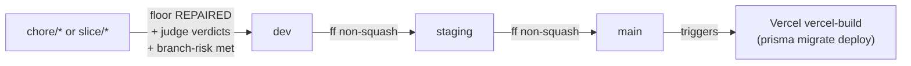

# 7. Worktrees and promotion

[← Workflows](06-workflows.md) · Next: [Worked examples →](08-examples.md)

## Disjoint-scope slices

Parallel autonomous work is safe only when each slice changes a different
**owner**. One slice = one owner = one worktree = one atomic change.

| Owner | Roughly |
| --- | --- |
| `retrieval` | corpus retrieval / FAQ lookup |
| `planner` | the turn planner prompt/logic |
| `validator` | safety/output validation |
| `state` | conversation/session state |
| `corpus` | the FAQ / knowledge corpus content |
| `scenario` | Hell Week scenarios / rubric |

```sh
just slice-new -- validator --dry-run   # preview
just slice-new -- validator             # create the worktree + branch
```

`scripts/slice-worktree.sh` creates `slice/<owner>-<stamp>` as a sibling under
the main repo root, copies the ignored local context git will not carry
(`.fallow`, `.claude/settings.local.json`, `.env.example`), and **never copies a
stale `.env`/`.env.local`** — render fresh with `--render <env>` or
`just secrets-render`.

It hard-refuses to create a protected branch (`dev`/`staging`/`main`) or one
already checked out elsewhere, and only ever uses a protected branch as a
read-only start-point.

## The promotion ladder



Rules (from `AGENTS.md`, enforced by discipline + `slice-worktree.sh`):

- Fast-forward, **non-squash** only; preserve full history. Stop on divergence.
- `main` accepts only `staging`; `staging` only `dev`.
- Operate from the **owning worktree** of the target branch. `dev` and `staging`
  are checked out in sibling worktrees — never move their pointers from here.
- Never squash / rebase / force-push.

## The promote-hop gate

Before crossing `staging` on an engine change:

1. `just floor-delta -- <run-dir>` reports **REPAIRED** (not HOLDING).
2. Judge verdicts present (`just hell-week-judge`), `ship_ready` not `needs_work`.
3. `just branch-risk` proof bar met for everything the branch changed.
4. The compare/digest receipt is embedded **inline in the PR body** — `artifacts/`
   is gitignored and dies with the worktree, so the receipt must survive in git.

Promotion to `main` triggers `vercel-build`, which runs `prisma migrate deploy`
against the real database — treat any migration as DEPLOY-tier risk and review it
before the hop.

## Anti-patterns (do not do)

- **Static routing restraints** (regex/keyword routing adjudication) — brittle;
  live integration evidence outweighs them ~100×. Keep only a tiny explicit
  safety/schema invariant.
- **Deduping demo-widget vs review-widget** — the near-duplication is deliberate;
  they are separate UIs. `gate-slice` blocks cross-boundary imports.
