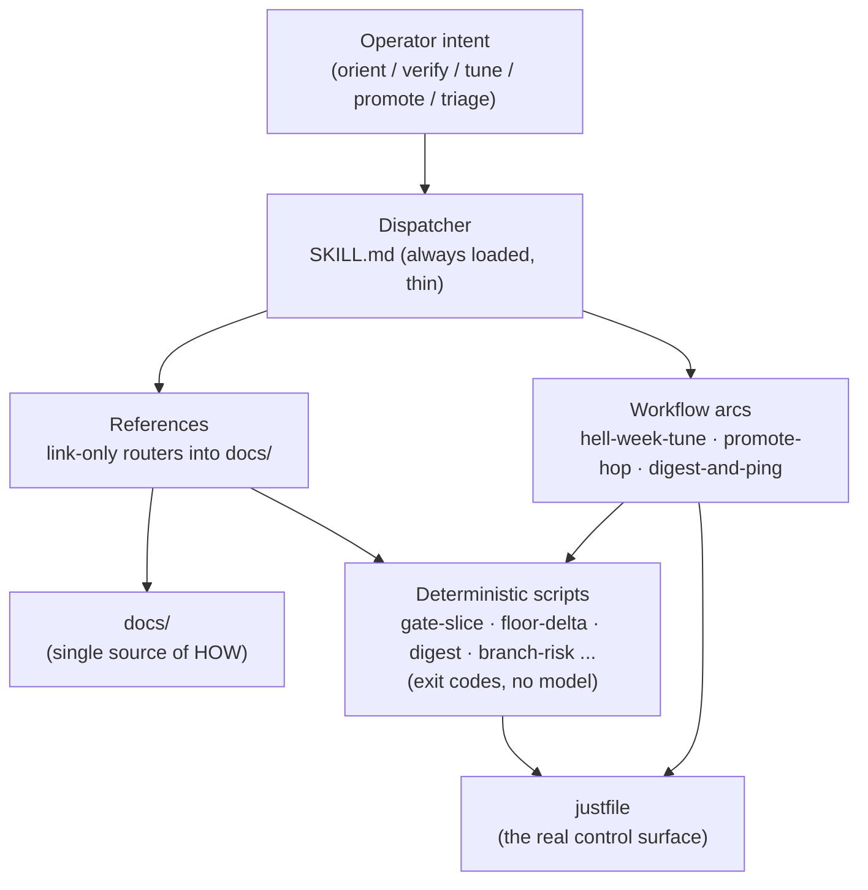

# LoanSlam Operator — User Manual

The `loanslam-operator` system turns this repo's `just` recipes, Hell Week
evidence tooling, and promotion rules into one navigable, agent-drivable
operator surface. It exists so you stop being a live "keep going / what next"
relay: judgment is front-loaded, routine work self-gates, and you are reached
only at a few high-signal checkpoints.

This manual is the human counterpart to the agent-facing skill at
[`.claude/skills/loanslam-operator/SKILL.md`](../../.claude/skills/loanslam-operator/SKILL.md).
The skill routes an agent; this manual explains the system to you.

## The system in one picture

## Read in this order

1. [Overview](01-overview.md) — what problem this solves and the mental model.
2. [Architecture](02-architecture.md) — the four tiers and why they are separate.
3. [Getting started](03-getting-started.md) — prerequisites, activating the gate, first run.
4. [Operations catalog](04-operations.md) — every `just` target, with examples.
5. [Proof and gates](05-proof-and-gates.md) — the baseline, floor-delta, gate-slice, branch-risk.
6. [Workflows](06-workflows.md) — the typed chains and the bounded tuning loop.
7. [Worktrees and promotion](07-worktrees-and-promotion.md) — slices and the dev→staging→main ladder.
8. [Worked examples](08-examples.md) — end-to-end command walkthroughs.
9. [Reference](09-reference.md) — commands, config fields, exit codes, file locations.
10. [Troubleshooting](10-troubleshooting.md) — failed gates, flaky evidence, recovery.

## The one rule

**Verify before reporting.** Never call route/planner/validator/demo/Hell Week
behaviour "done" from unit tests — those are scaffolding. Behaviour is proven
only by a full Hell Week run scored against the committed baseline. See
[Proof and gates](05-proof-and-gates.md).
