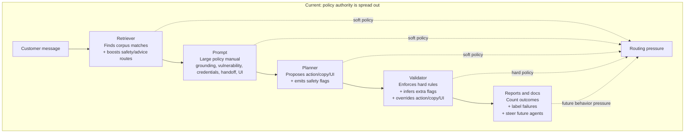
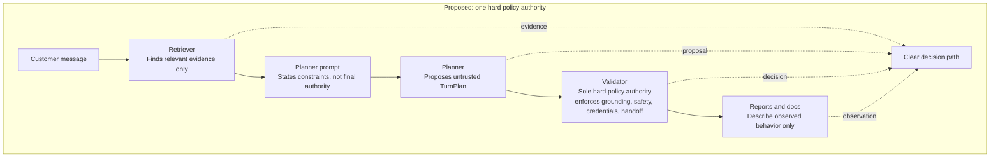

# Policy Authority Boundaries

## Practical Takeaway

Phase 0 should have one hard policy authority. Retrieval should surface evidence,
the planner should propose an untrusted next move, the validator should enforce hard
rules, and reports should describe what happened. Complexity appears when several
layers each start making or reshaping policy decisions.

## Current Shape



In this shape, an over-handoff can come from retrieval ranking, prompt caution,
planner flags, validator inference, or report wording. The system may still behave
safely, but debugging gets muddy because several layers have shaped the decision.

## Proposed Shape



This does not mean making the system less safe. It means being strict about roles:

- Retriever: evidence only.
- Prompt and planner: untrusted proposal only.
- Validator: hard policy authority.
- Reports and docs: observation only.

## Consequence

With one hard policy authority, failure analysis stays simple:

```text
Did retrieval find the right evidence?
Did the planner propose something reasonable?
Did the validator enforce the correct hard rule?
Did the report describe the outcome accurately?
```

With several policy owners, each failure has more possible causes, and future changes
are harder to make safely.
